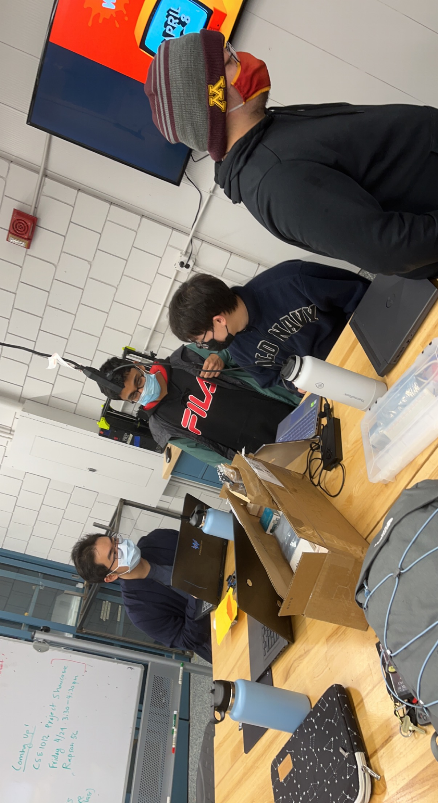

# SASE Labs is awesome

This is the codebase & showcase page for SASE Labs 2021-2022 interdisciplinary STEM projects
This year, we worked on two projects, one of our choosing and one client-driven solution:
1. GOPHER Bin - a machine-learned waste categorizer that sorts objects based on their biodegradability
2. Ultrasonic sensor - a SASE Clients motion detector for tracking attendance at the Belwin Conservancy in Afton, MN

At the end of the academic year, SASE Labs had a demo symposium, where all SASE Labs members presented their awesome projects to friends, fellow UMN STEM students, and UMN faculty. [Here](https://docs.google.com/presentation/d/1pVfOZR1zcArs8Ue3XmOcpOOsQrmrRNc9f-MIYefE6zo/edit?usp=sharing) is the general presentation, which explains what SASE Labs is and tells you more about what we got up to over the 2021-2022 school year :) 

## Now, what is the GOPHER Bin?

With the goal of contributing to STEM efforts in combating environmental protection and pollution reduction, SASE Labs members designed, prototyped, and built a solution over the course of 15 weeks with a budget of $150. The 18 members were split into 3 subteams:

### Mechanic & Material Research (MMR)

|  |
| :--: |
| **MMR subteam members adding finishing touches to some parts while attending full team meeting** |

This team was responsible for designing the infrastructure and functional design of the GOPHER Bin. Additionally, they were tasked with researching which materials were necessary and could fit in the team's budget. To learn about the wonderous details, see MMR's summary presentation [here](https://docs.google.com/presentation/d/1cbf5pPYIVQ8R_U1uu8z4xNOSi1JpKx0HbOv_MgPGEE4/edit?usp=sharing).

### Motor

|  |
| :--: |
| **Motor subteam members working on the code to sync motors** |

This team implemented the motor carriage, wired up & sautered the Raspberry pi, and wrote the code to run the motors. To learn about the awesome details, see the motor subteam's summary presentation [here](https://docs.google.com/presentation/d/17_5_Mc0rvraCFtMVoYEmTYN52wZq_VuWoQYDpJxbDKM/edit?usp=sharing).

### Vision

|  |
| :--: |
| **Vision subteam perfecting the CNN model on Google Colab** |

This team built the biodegrability object database, and developed the automatic classification module. To learn about the epic details, see the vision subteam's summary presentation [here](https://docs.google.com/presentation/d/1KSN-VilFwoDhQrX49aA4bzVUpPa_dgvbRszLV9H1Rfw/edit?usp=sharing).

## What is SASE Clients' Ultrasonic Sensor?

|  |
| :--: |
| **Some SASE Clients members talking about their 3D prints** |

SASE Labs members were pitched numerous different client-driven projects, and the [Belwin Conservancy](https://belwin.org/) was chosen as this year's client. They had issues with theft of their trail cameras and parking lot cameras. The SASE Clients team's solution had two benefits: the design made it significantly less alluring for theft, and improved the process of how the Conservancy tracked attendance at their trails. To learn about the phenomenal details, see SASE Clients' summary presentation [here](https://docs.google.com/presentation/d/1mfjcAvBrkN6oWS7IdneRZFBzLIogwlgx5wgbrG3M8Ho/edit?usp=sharing).